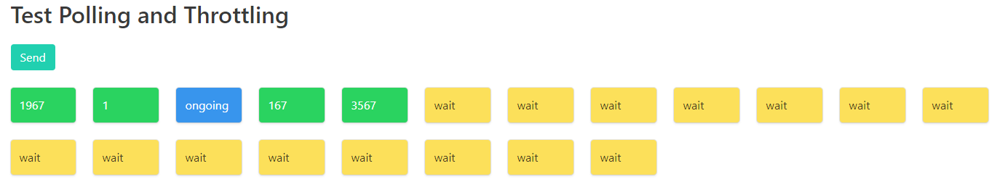

# Throttler
Throttler to limit parallel request and rate

## Demo

the important file is [Throttler.js](Throttler.js) the rest is here for Demo purpose, you can launch the Demo with

```
npm install
npm run start
```

and connect with your browser on port 9001, after clicking a bit on the **send** button you should see:



## Constructor

```
Throttler(nb, rate, send)
```

- **nb** is the number of parallel request
- **rate** is an object which defined the time windows rate limiting, it contain **nb** and **time** in ms
- **send** is a function which send back a promise, it's what we try to throttle

## Use

just call ```throttler.send()``` and it will return a promise which will be resolve when the request has been sent

## Polling

in my example [client.js](client.js) I use a polling mechanism, so the request given to the throttler don't need to be a simple request. In the demo, the first request is to start the computation, then poll the result every second
